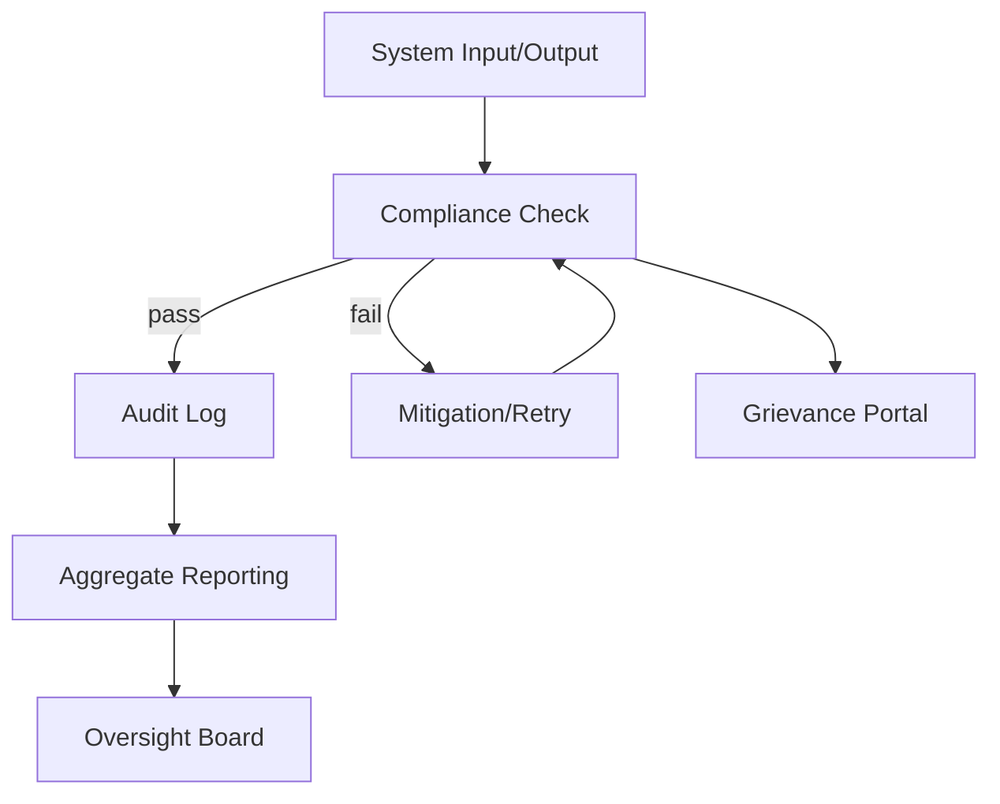

 # CACF Governance Flow (Mermaid)

```mermaid
flowchart TB
  Input[System Input/Output] --> Check[Compliance Check]
  Check -->|pass| Log[Audit Log]
  Check -->|fail| Mitigate[Mitigation/Retry]
  Mitigate --> Check
  Log --> Report[Aggregate Reporting]
  Report --> Oversight[Oversight Board]
  Check --> Grievance[Grievance Portal]
```

See: ../../compliance/cacf_compliance/
